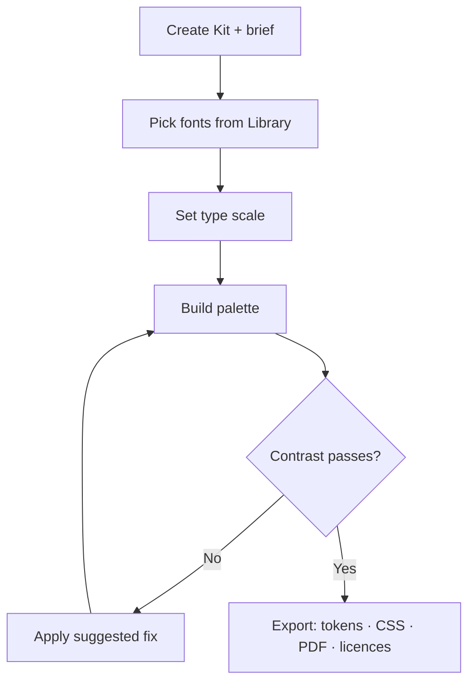
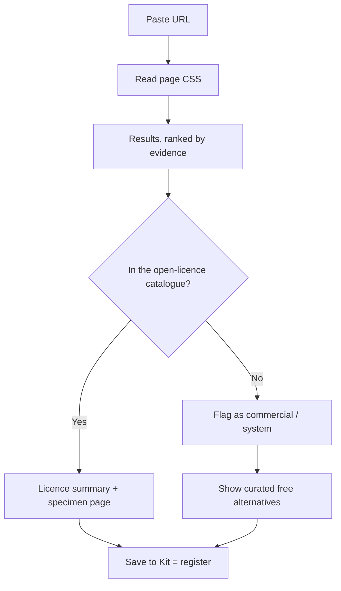

# 03 — Information architecture & user flows

**IA is the map** — every screen and how they nest. **Flows are the routes** people walk to finish a job.

Public tools sit outside the login wall (the SEO surface). The Kit lives inside it.

---

## Sitemap

```
/                              Landing
│
├── Public · no login — the SEO surface
│   ├── /fonts                 Font Library      · search, filter
│   │   └── /fonts/[slug]      Specimen          · ~1,900 pages
│   ├── /type-scale            Type Scale Studio
│   ├── /colour                Colour Studio
│   ├── /identify              Font ID · URL now, image in Phase 3
│   ├── /licences              Licensing explained
│   └── /roadmap               What ships when
│
├── /auth                      Sign in / up                      ◻ Phase 2
│
└── App · authenticated                                          ◻ Phase 2
    ├── /dashboard             Kits list
    ├── /kit/[id]
    │   ├── fonts   scale   palette
    │   ├── boards  export  history
    └── /settings
```

**The bridge.** A public tool's **"save to Kit"** action is the register moment — the single prompt that moves an anonymous visitor into the app. It is the only place Phase 2 is allowed to ask for an account, and it should appear only after the visitor has something worth saving.

---

## Flow A · New project



The loop at `E` is the point of the whole tool. Most palette tools tell you a pair fails and stop; this one returns the nearest passing colour along the same hue and lets you take it in one click. `suggestAccessible()` in `src/lib/contrast.ts`.

**Live today** without the Kit: pick a font at `/fonts`, carry it into `/type-scale?font=<slug>`, build the palette at `/colour`, copy each export. Phase 2 makes that one saved object instead of three tabs.

---

## Flow B · Font identification



`H` is greyed out until Phase 2. Everything before it works now.

**Why evidence beats frequency.** A single `@font-face` rule proves the page ships that font. Fifty `font-family` declarations across utility classes prove only that someone wrote a lot of CSS. Confidence is set by the strongest evidence found, never by a count:

| Evidence | Confidence |
| --- | --- |
| Google Fonts stylesheet URL | 0.95 |
| `@font-face` rule | 0.88 |
| `font-family` on `html` / `body` / `:root` | 0.70 |
| Any other declaration | 0.35 – 0.62, by occurrence |

---

## Screen inventory · Phase 1

| Screen | State it holds | Where the state lives |
| --- | --- | --- |
| Font Library | query, category, subset, variable, italic, licence, sort, page | URL — shareable, cacheable, indexable |
| Specimen | size, weight, italic, sample text | Component state; nothing worth persisting yet |
| Type Scale Studio | base, ratio, steps, rounding, two fonts | Component state; `?font=` seeds it |
| Colour Studio | swatches, harmony, export format | Component state |
| Identify | URL, results | Component state; the request is `no-store` |

Phase 2 moves the Type Scale and Colour state into the Kit. Until then, nothing is stored server-side and nothing needs a cookie banner.
