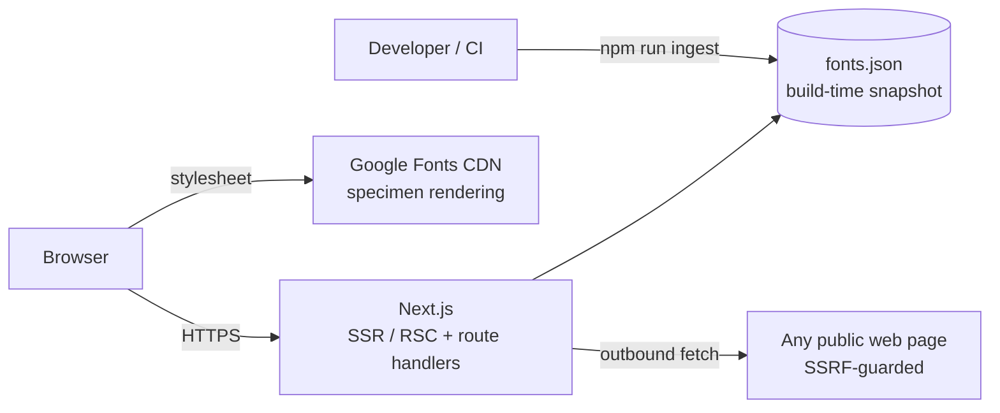
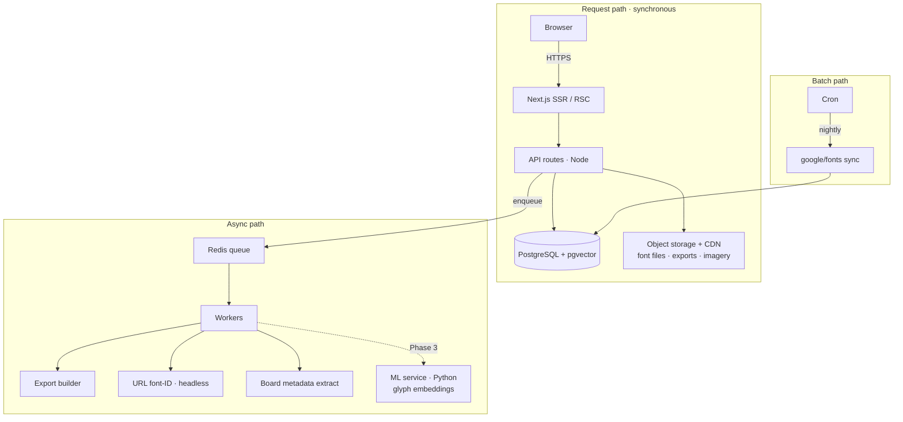

# 05 — System architecture

Left of the queue is synchronous and cheap. Right of it is asynchronous and scales independently. Almost none of the right-hand side exists yet, and that is the point.

---

## Phase 1 — what actually runs today

One deployable unit. No database, no queue, no object storage, no secrets. The catalogue is compiled into the build; a refresh is a commit.

---

## Phase 2+ — the shape it grows into

The ML service is dashed because the entire product is built and shipped without it. It arrives in Phase 3 for image-mode identification and nothing else depends on it.

---

## Why this order

**The queue arrives with the first job that can fail slowly.** Today the only outbound work is one identification request, bounded at six seconds, on the request path. Introducing Redis, a worker process and a job-status polling contract before there is a job worth queuing is infrastructure for its own sake.

**The database arrives with the first write.** Phase 1 has no user-owned state. Adding Postgres now would mean provisioning, connection pooling, migrations in CI and a monthly bill, in exchange for slower reads than an in-process array scan.

**Object storage arrives with export.** Self-hosting `.woff2` matters when Baseline ships font files inside a zip with their licence text — that is the export engine, which is Phase 2. Until then Google's CDN serves specimens perfectly well.

Each piece is added when a feature needs it, not when the diagram looks incomplete.

---

## Caching

| Surface | Strategy |
| --- | --- |
| `/fonts/[slug]` | Static prerender for the top 300 families, ISR for the tail (`revalidate: 1 week`) |
| `/fonts` | Server-rendered per filter combination; filters are URL params, so each is independently cacheable |
| `/api/fonts` | `s-maxage=86400, stale-while-revalidate=604800` |
| `/api/identify/url` | `no-store` — the result is about someone else's page and can change any time |
| Specimen fonts | Google Fonts CDN, `display=swap` |

Prerendering all ~1,900 font pages would add minutes to every deploy for pages that see a handful of visits a month. The top 300 cover the overwhelming majority of search traffic; the rest render once on first request and are then cached like any other.
