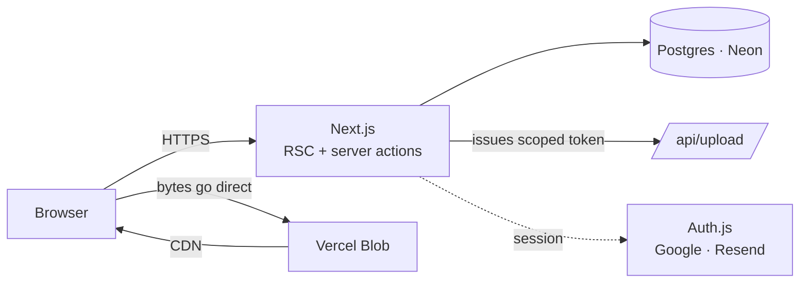

# 07 — The community section

Post work, save other people's into collections, follow the creators, message them. A Behance/Pinterest-shaped layer sitting alongside the tools.

This is the first feature that needs accounts, a database and file storage, so Phase 2 infrastructure landed here rather than at the Kit.

---

## What it is for

The tools half of Baseline answers *what should I set this in?* The community half answers *what have other people done?* — and the join between them is the thing neither has on its own.

**Every project lists the fonts and colours behind it.** A post is not a picture; it is a picture with `Fraunces` and `#3d5afe` attached, both linking back into the library and the studios. That is the whole reason to build this rather than send people to Behance: nobody else's feed tells you what the type was.

It also gives the Phase 2 Kit somewhere to point. "Save to Kit" from a public tool was always meant to be the register moment; "save to a collection" is the same move with a lower barrier, and it works before the Kit exists.

---

## Architecture

**Uploads never pass through the function.** The browser asks `/api/upload` for a token, that route checks sign-in and the rate limit, then the bytes go straight from the browser to Blob. A serverless function has a hard 4.5 MB request body limit, and proxying an 8 MB image would burn function time for nothing.

**Reads and writes are both server-side.** Server components for reads, server actions for writes. There is no client-side data fetching and no API layer for the UI to drift from.

---

## Decisions worth keeping

### Database sessions, not JWT

A suspended account has to lose access immediately. A JWT valid for another thirty days cannot be revoked without building a denylist, which is a session table with extra steps. `session: { strategy: "database" }`.

### Blocks are applied inside the query

If A blocks B, B's work is filtered out of A's feed by the `WHERE` clause, not by a `.filter()` after fetching. Filtering afterwards means the row still travelled to the server that renders A's page, and one forgotten call leaks it. `blockedUserIds()` returns both directions — people I blocked and people who blocked me — and every feed, profile, collection and inbox query takes it.

Blocking also deletes any follow in either direction. Leaving a follow in place after a block is the bug that lets someone keep watching.

### Counters are denormalised, and updated transactionally

`likeCount`, `saveCount` and `itemCount` are columns, because sorting a feed by a `COUNT(*)` join per row is what kills a feed at scale. Every write that changes a count does so in the same `$transaction` as the row it counts, so the two cannot drift. The smoke test asserts it.

### Conversations have members, not a sender and a recipient

The UI only exposes one-to-one threads. The table does not: `Conversation` has `ConversationMember` rows. A group thread is the obvious next request, and retrofitting one onto a two-column table means a data migration over live message history.

`lastMessageAt` is denormalised onto the conversation so the inbox can order threads without a correlated subquery per row, and read state is per-member (`lastReadAt`) so "unread" is a timestamp comparison rather than a scan.

### Removed content is hidden, not deleted

A moderator sets `status: REMOVED`. The author can still see it — an appeal needs something to point at, and an open report needs a target. Everyone else gets a 404 rather than a "this was removed" page, because the second one confirms the post existed.

### Rate limits live in Postgres

Fixed-window counters in a `rate_limits` table. Not Redis, because there is no Redis and adding one for this alone is not worth the moving part. Fixed window over sliding window is a deliberate trade — a caller can burst across a boundary and briefly get 2× the limit, which is entirely acceptable for "stop someone posting 400 projects an hour" and costs one row instead of one per event.

When it does become the bottleneck, `checkRateLimit()`'s signature is what moves to Redis, not its callers.

### Images bypass `next/image`

Uploads are served straight from the Blob CDN with a plain ``. `next/image` would run attacker-supplied bytes through sharp/libvips, which currently carries unpatched CVEs with no fixed release in any Next 16 line. The blob is already CDN-cached and intrinsic dimensions are recorded at upload, so the optimiser buys almost nothing here and costs a real attack surface. Documented as a scoped rule override in `eslint.config.mjs`; revisit when sharp is patched.

---

## Moderation

Built before the first user, not after the first incident.

| Control | Behaviour |
| --- | --- |
| Block | Symmetric, applied in queries, severs follows both ways, silences the thread |
| Report | Reason + optional detail, on a project, a message or an account; queued with a status |
| Suspend | Read-only account. Cannot post, save, follow or message; sees the reason |
| Remove | Content hidden from everyone but its author |
| Rate limits | Uploads, posts, messages, new conversations, follows, saves, reports |

The tightest limit is deliberately **new conversations: 10 per day**. A new account messaging many different people quickly is the harassment pattern worth stopping; sixty messages an hour inside existing threads is just a conversation.

One gate enforces all of it. `requireOnboarded()` (server components) and `getOnboardedUser()` (route handlers) are the only places that check sign-in, onboarding and suspension, so there is exactly one thing to get right.

---

## Attribution

Posting someone else's work is allowed and expected — that is half of what a Pinterest-shaped feed is for. Claiming it is not.

The submit form asks *whose work is this?* before it asks anything else. Choosing "someone else's" requires a credit and a link, and both are shown on the project page. `STOLEN_WORK` is the first report reason in the list, not buried under "other".

---

## What is not built

- **Comments.** Messaging covers "talk to the creator"; comments are a separate moderation surface with a much worse ratio of value to abuse. Worth adding only once there is enough traffic to need it.
- **Notifications.** No email on follow, like or message. The inbox shows unread state; that is enough until people ask.
- **A moderator UI.** Reports are queued in the database and read with SQL. A queue view is worth building when the first report arrives, not before.
- **Image moderation.** No automated scanning. At current scale, reports plus a human are the honest answer.
